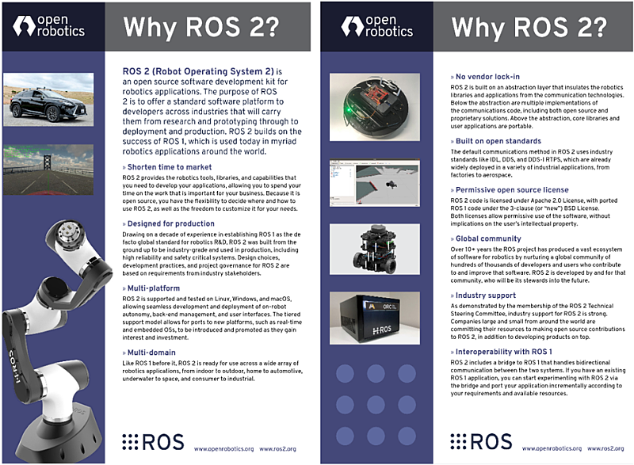
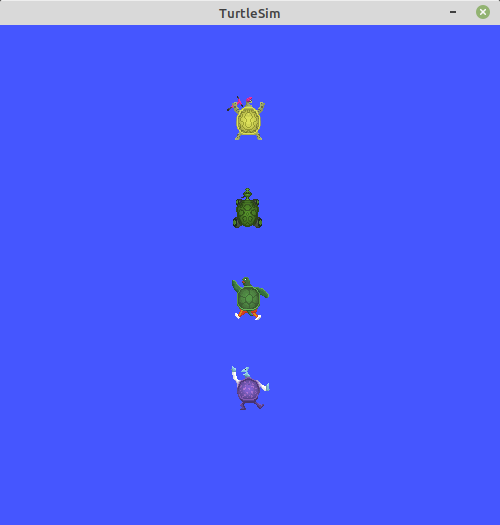
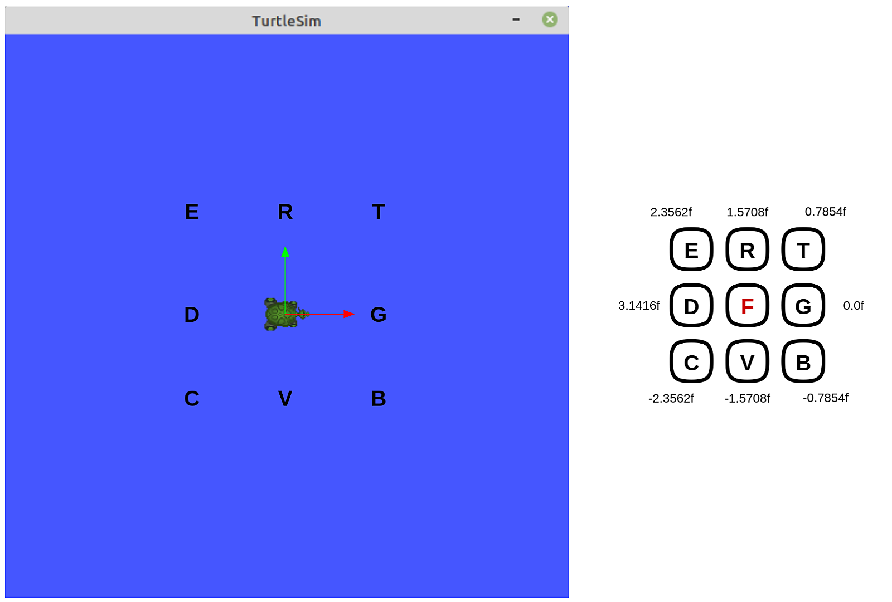
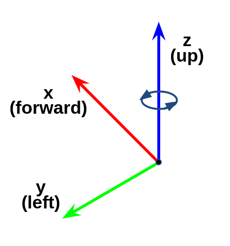
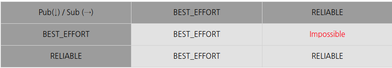
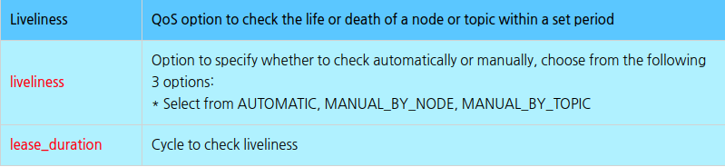

Created By: Khaled Gabr

# Introduction To ROS 2

## **Setting up ROS 2 Development Environment**

### **1. Introduction to Development Environment**

In this course, we will use **Linux Ubuntu 22.04** as the base operating system, and the Robot Operating System (ROS) version used will be **ROS 2 Humble Hawksbill**. It is essential to set up the development environment correctly to ensure all components of ROS 2 work smoothly. This guide will walk you through the installation of Ubuntu 22.04, ROS 2 Humble, and the necessary development tools to get started.

### **2. Installing the Base Operating System: Linux Ubuntu 22.04**

ROS 2 is designed to work best on Linux, particularly Ubuntu. To set up ROS 2 Humble, you need to install Ubuntu 22.04 on your machine. Follow these steps to install Ubuntu:

1. **Download Ubuntu 22.04**:
   - Go to the [Ubuntu download page](https://ubuntu.com/download) and download the 22.04 LTS version.

2. **Create a Bootable USB Drive**:
   - Use a tool like **Rufus** (for Windows) or **Etcher** (for macOS/Linux) to create a bootable USB drive with the downloaded Ubuntu ISO file.

3. **Install Ubuntu 22.04**:
   - Insert the bootable USB drive into your computer and restart it.
   - Follow the on-screen instructions to install Ubuntu 22.04, ensuring you allocate enough disk space for the installation and development work.

### **3. Installing the Robot Operating System: ROS 2 Humble**

With Ubuntu 22.04 installed, we will now install ROS 2 Humble. Follow these steps:

1. **Set locale**:

  ```bash
  locale  # check for UTF-8

  sudo apt update && sudo apt install locales
  sudo locale-gen en_US en_US.UTF-8
  sudo update-locale LC_ALL=en_US.UTF-8 LANG=en_US.UTF-8
  export LANG=en_US.UTF-8

  locale  # verify settings
  ```

2. **Setup Sources**:

  First ensure that the Ubuntu Universe repository is enabled.

  ```bash
  sudo apt install software-properties-common
  sudo add-apt-repository universe
  ```

  Now add the ROS 2 GPG key with apt.

  ```bash
  sudo apt update && sudo apt install curl -y
  sudo curl -sSL https://raw.githubusercontent.com/ros/rosdistro/master/ros.key -o /usr/share/keyrings/ros-archive-keyring.gpg
  ```

  Then add the repository to your sources list.

  ```bash
  echo "deb [arch=$(dpkg --print-architecture) signed-by=/usr/share/keyrings/ros-archive-keyring.gpg] http://packages.ros.org/ros2/ubuntu $(. /etc/os-release && echo $UBUNTU_CODENAME) main" | sudo tee /etc/apt/sources.list.d/ros2.list > /dev/null
  ```

3. **Install ROS 2 Humble**:

   ```bash
   sudo apt update
   sudo apt install ros-humble-desktop
   ```

4. **Setup Environment**:

   After installation, you need to set up your environment:

   ```bash
   source /opt/ros/humble/setup.bash
   ```

5. **Install Dependencies**:

   You will also need to install dependencies for building and running ROS 2 packages:

   ```bash
   sudo apt install ros-dev-tools
   ```

### **4. Installing ROS 2 Development Tools**

To develop effectively in ROS 2, you need a set of essential development tools. Run the following commands to install these tools:

1. **Basic Development Tools**:

   ```bash
   sudo apt update && sudo apt install -y \
   build-essential cmake git libbullet-dev python3-colcon-common-extensions python3-flake8 python3-pip \
   python3-pytest-cov python3-rosdep python3-setuptools python3-vcstool wget
   ```

2. **Python Development Tools**:

   ```bash
   python3 -m pip install -U \
   argcomplete flake8-blind-except flake8-builtins flake8-class-newline flake8-comprehensions flake8-deprecated \
   flake8-docstrings flake8-import-order flake8-quotes pytest-repeat pytest-rerunfailures pytest
   ```

3. **Additional Libraries**:

   ```bash
   sudo apt install --no-install-recommends -y libasio-dev libtinyxml2-dev libcunit1-dev
   ```

### **5. Setting Up Run Commands for Convenience**

To streamline your ROS 2 workflow, it's useful to add frequently used commands, environment variables, and aliases to your `.bashrc` file. This file runs every time you open a new terminal, saving you from retyping commands.

1. **Open the `.bashrc` File**:
   You can use any text editor you're comfortable with:

   ```bash
   nano ~/.bashrc
   ```

   Or use other editors like `vim` or `xed`.

2. **Add the Following Lines to `.bashrc`**:

   ```bash
   source /opt/ros/humble/setup.bash
   source ~/colcon_ws/install/local_setup.bash
   source /usr/share/colcon_argcomplete/hook/colcon-argcomplete.bash
   source /usr/share/vcstool-completion/vcs.bash
   source /usr/share/colcon_cd/function/colcon_cd.sh

   export _colcon_cd_root=~/colcon_ws
   export ROS_DOMAIN_ID=7
   export ROS_NAMESPACE=robot1

   export RMW_IMPLEMENTATION=rmw_fastrtps_cpp
   # Uncomment the desired RMW implementation:
   # export RMW_IMPLEMENTATION=rmw_connext_cpp
   # export RMW_IMPLEMENTATION=rmw_cyclonedds_cpp
   # export RMW_IMPLEMENTATION=rmw_gurumdds_cpp

   export RCUTILS_CONSOLE_OUTPUT_FORMAT='[{severity} {time}] [{name}]: {message} ({function_name}() at {file_name}:{line_number})'
   export RCUTILS_COLORIZED_OUTPUT=1
   export RCUTILS_LOGGING_USE_STDOUT=0
   export RCUTILS_LOGGING_BUFFERED_STREAM=1

   alias cw='cd ~/colcon_ws'
   alias cs='cd ~/colcon_ws/src'
   alias ccd='colcon_cd'

   alias cb='cd ~/colcon_ws && colcon build --symlink-install'
   alias cbs='colcon build --symlink-install'
   alias cbp='colcon build --symlink-install --packages-select'
   alias cbu='colcon build --symlink-install --packages-up-to'
   alias ct='colcon test'
   alias ctp='colcon test --packages-select'
   alias ctr='colcon test-result'

   alias rt='ros2 topic list'
   alias re='ros2 topic echo'
   alias rn='ros2 node list'

   alias killgazebo='killall -9 gazebo & killall -9 gzserver & killall -9 gzclient'

   alias af='ament_flake8'
   alias ac='ament_cpplint'

   alias testpub='ros2 run demo_nodes_cpp talker'
   alias testsub='ros2 run demo_nodes_cpp listener'
   alias testpubimg='ros2 run image_tools cam2image'
   alias testsubimg='ros2 run image_tools showimage'
   ```

3. **Save and Apply the Changes**:
   Save the file and run:

   ```bash
   source ~/.bashrc
   ```

   This command reloads the `.bashrc` file to apply the new settings immediately.

---

## **Key Concepts and Features of ROS 2**

### **Why ROS 2?**

ROS 2 (Robot Operating System 2) is an open-source software development kit (SDK) for building robotic applications, designed to cater to both research and commercial use. Released by Open Robotics, ROS 2 builds upon the success and experience of ROS 1, which has been used worldwide in various robotics applications since 2007.

This section explores the main reasons why ROS 2 has become the preferred choice for robotics developers, summarizing the key concepts and unique features that make ROS 2 stand out in the field of robotics.



### **1. Shortened Time to Market**

One of the most significant benefits of using ROS 2 is the reduction in time needed to develop and deploy robotic applications. ROS 2 provides a comprehensive set of tools, libraries, and functions that eliminate the need for developers to create a custom framework from scratch.

This allows developers to focus on the critical aspects of robotic development rather than spending valuable time selecting communication methods, building debugging and visualization tools, or dealing with proprietary software limitations. Moreover, as an open-source platform developed by a community rather than a single commercial entity, ROS 2 offers flexibility in how and where it is used, allowing modifications as needed to fit specific project requirements.

### **2. Designed for Production**

ROS 2 has been developed with a strong emphasis on industrial needs, unlike its predecessor, ROS 1, which was more academic in nature. Over the years, ROS has become the de facto standard for robotics research and development worldwide. ROS 2 takes this a step further by incorporating the industry's requirements for high reliability, safety, and performance.

The design, development, and project management of ROS 2 are based on real-world feedback from industrial stakeholders, ensuring it is ready for both prototyping and full-scale production.

### **3. Multi-Platform Support**

ROS 2 is designed to be flexible and cross-platform, supporting and tested on **Linux, Windows, and macOS**. This allows developers to build and deploy robotic applications across various platforms, including desktop environments, embedded systems, and real-time operating systems (RTOS).

This multi-platform capability enables seamless development and deployment, providing a consistent experience whether you are managing autonomy, backend operations, or user interfaces.

### **4. Multi-Domain Usability**

Much like its predecessor, ROS 2 is designed to be versatile, supporting a wide range of robotic applications across multiple domains:

- **Indoor and Outdoor Robotics**: From warehouse automation to field robots.
- **Home and Automotive Applications**: Enabling smart home devices and autonomous vehicles.
- **Underwater and Space Exploration**: Powering subsea robots and extraterrestrial rovers.
- **Consumer to Industrial**: Used in applications ranging from personal robots to large-scale industrial automation.

ROS 2 offers a consistent development experience across these varied environments, making it a universal tool for all kinds of robotics applications.

### **5. Vendor Flexibility**

ROS 2 provides flexibility in vendor selection by abstracting robotics libraries and applications from the underlying communication functions. This abstraction allows developers to use a range of communication methodologies, from open-source solutions to proprietary ones, depending on their project needs.

Core libraries and user applications can be developed, modified, and extended atop this abstraction, ensuring a tailored fit for different use cases and environments.

### **6. Based on Open Standards**

ROS 2 uses widely adopted industry standards for communication, such as **IDL (Interface Definition Language), DDS (Data Distribution Service), and DDS-I RTPS (Real-Time Publish-Subscribe)**. These standards are commonly used across many sectors, including manufacturing, aerospace, and automotive industries, ensuring compatibility and interoperability across a wide range of applications.

### **7. Open-Source Licensing with Broad Permissions**

The ROS 2 codebase is licensed under the **Apache 2.0 license**, which provides a wide scope of discretionary permission for developers and businesses. This means that you can use ROS 2 freely without affecting your intellectual property rights, whether you are developing for research purposes or commercial products.

### **8. Global Community**

The ROS project has fostered a global community of hundreds of thousands of developers and users over the past decade. This community has contributed to the creation and improvement of a vast ecosystem of software packages and tools. ROS 2 continues this tradition of being developed "by the community, for the community," ensuring that it remains up-to-date, well-supported, and aligned with the needs of its users.

### **9. Strong Industrial Support**

ROS 2 enjoys robust support from the robotics industry. Many companies, both large and small, are contributing resources and expertise to the development of ROS 2. The **ROS 2 Technical Steering Committee** includes members from various companies who provide input and feedback, ensuring that the platform meets industrial standards and remains competitive.

### **10. Interoperability with ROS 1**

For developers who have already invested in ROS 1, ROS 2 provides a bridge for interoperability. This bridge allows for bidirectional communication between ROS 1 and ROS 2 systems, enabling existing ROS 1 applications to be tested with ROS 2. This approach allows for a gradual transition from ROS 1 to ROS 2 based on your needs and available resources.

---

## **Features of ROS 2 through the Differences between ROS 1 and ROS 2**

### **1. ROS 2 Overview**

ROS 2 (Robot Operating System 2), released by Open Robotics on December 8, 2017, is a complete overhaul of the existing ROS (hereinafter referred to as ROS 1). It is not backward compatible with ROS 1, as it was developed to address several limitations and add new functionalities required in the current robotic development landscape.

The development history of ROS 2 reflects a shift towards a more robust, real-time, and flexible platform suitable for both academic research and commercial applications. Below is a timeline of ROS 2 releases:

- **2024.05.23 - ROS 2 Jazzy Jalisco (LTS, 5 years support)**
- **2023.05.23 - ROS 2 Iron Irwini**
- **2022.05.23 - ROS 2 Humble Hawksbill (LTS, 5 years support)**
- **2021.05.23 - ROS 2 Galactic Geochelone**
- **2020.06.05 - ROS 2 humble Fitzroy (LTS, 3 years support)**
- **2019.11.22 - ROS 2 Eloquent Elusor**
- **2019.05.31 - ROS 2 Dashing Diademata (First LTS, 2 years support)**
- **2018.12.14 - ROS 2 Crystal Clemmys**
- **2018.07.02 - ROS 2 Bouncy Bolson**
- **2017.12.08 - ROS 2 Ardent Apalone (1st version)**

#### **ROS 2 Pre-releases:**

- **2017.09.13 - ROS 2 Beta3 (code name R2B3)**
- **2017.07.05 - ROS 2 Beta2 (code name R2B2)**
- **2016.12.19 - ROS 2 Beta1 (code name Asphalt)**
- **2016.10.04 - ROS 2 Alpha8 (code name Hook.and.Loop)**
- **2016.07.14 - ROS 2 Alpha7 (code name Glue Gun)**
- **2016.06.02 - ROS 2 Alpha6 (code name Fastener)**
- **2016.04.06 - ROS 2 Alpha5 (code name Epoxy)**
- **2016.02.17 - ROS 2 Alpha4 (code name Duct Tape)**
- **2015.12.18 - ROS 2 Alpha3 (code name Cement)**
- **2015.11.03 - ROS 2 Alpha2 (code name Baling Wire)**
- **2015.08.31 - ROS 2 Alpha1 (code name Anchor)**

### **ROS 1 Limitations and Need for ROS 2**

ROS 1, which began development in 2007, was initially designed for academic and research purposes. Developed by Willow Garage for the personal service robot PR2, ROS 1 has been widely adopted by universities, research institutes, industries, and hobbyists. However, the development environment of ROS 1 inherited several limitations from its origins:

- `Single robot use`
- `Workstation-class computer dependency`
- `Exclusive Linux environment`
- `Lack of real-time control`
- `Requirement for a stable network environment`
- `Primarily for academic research purposes`

These limitations are at odds with the modern requirements of robotics development, which demands:

- `Multi-robot support`
- `Usage in embedded systems`
- `Real-time control`
- `Flexibility in unstable network environments`
- `Multi-platform support (Linux, macOS, Windows)`
- `Integration with the latest technologies (e.g., Zeroconf, Protocol Buffers, ZeroMQ, WebSockets, DDS)`
- `Commercial product support`

To address these needs, ROS 2 was developed as a separate version with next-generation features, allowing existing ROS 1 users to continue using ROS 1 if they do not require the new features. A bridge program, `ros1_bridge`, facilitates communication between ROS 1 and ROS 2, allowing both versions to be used together.

### **2. Differences Between ROS 1 and ROS 2**

The following table summarizes the key differences between ROS 1 and ROS 2:

| **Feature**                    | **ROS 1**                                                    | **ROS 2**                                                                          |
|--------------------------------|--------------------------------------------------------------|-------------------------------------------------------------------------------------|
| **Platforms**                  | Linux, macOS                                                 | Linux, macOS, Windows                                                               |
| **Real-time**                  | External frameworks like OROCOS                              | Real-time nodes with proper RTOS and carefully written user code                    |
| **Security**                   | SROS                                                         | SROS 2, DDS-Security, Robotic Systems Threat Model                                   |
| **Communication**              | XMLRPC + TCPROS                                              | DDS (RTPS)                                                                          |
| **Middleware Interface**       | -                                                            | `rmw`                                                                               |
| **Node Manager (Discovery)**   | ROS Master                                                   | No, uses DDS’s dynamic discovery                                                    |
| **Languages**                  | C++03, Python 2.7                                            | C++14 (C++17), Python 3.5+                                                          |
| **Client Library**             | `roscpp`, `rospy`, `rosjava`, `rosnodejs`, and more          | `rclcpp`, `rclpy`, `rcljava`, `rclobjc`, `rclada`, `rclgo`, `rclnodejs`             |
| **Build System**               | `rosbuild` → `catkin` (CMake)                                | `ament` (CMake), Python setuptools (Full support)                                   |
| **Build Tools**                | `catkin_make`, `catkin_tools`                                | `colcon`                                                                            |
| **Build Options**              | -                                                            | Multiple workspace, No non-isolated build, No devel space                           |
| **Version Control System**     | `rosws` → `wstool`, `rosinstall` (`*.rosinstall`)            | `vcstool` (`*.repos`)                                                               |
| **Life Cycle**                 | -                                                            | Node lifecycle                                                                      |
| **Multiple Nodes**             | One node per process                                         | Multiple nodes per process                                                          |
| **Threading Model**            | Single-threaded or multi-threaded execution                  | Custom executors                                                                    |
| **Messages (Topic, Service, Action)** | `*.msg`, `*.srv`, `*.action`                                       | `*.msg`, `*.srv`, `*.action`, `*.idl`                                               |
| **Command Line Interface**     | `rosrun`, `roslaunch`, `ros topic`                           | `ros2 run`, `ros2 launch`, `ros2 topic`                                             |
| **roslaunch**                  | XML                                                          | Python, XML, YAML                                                                   |
| **Graph API**                  | Remapping at startup only                                    | Remapping at runtime                                                                |
| **Embedded Systems**           | `rosserial`, `mROS`                                          | `micro-ROS`, `XEL Network`, `ros2arduino`, `Renesas`, `DDS-XRCE` (`Micro-XRCE-DDS`), `AWS ARCLM` |

### **3. Key Features of ROS 2**

#### **3.1 Platforms**

ROS 2 supports `Linux`, `Windows`, and `macOS`, making it versatile across all major operating systems. It allows for easy installation using binary files, providing greater accessibility, especially for Windows users.

#### **3.2 Real-time Support**

ROS 2 supports real-time capabilities, provided specific hardware, a real-time operating system (`RTOS`), and suitable communication protocols like DDS's RTPS (Real-time Publish-Subscribe Protocol) are used. This makes ROS 2 suitable for time-sensitive applications.

#### **3.3 Security**

Security was a `low` priority in ROS 1, leading to several vulnerabilities. ROS 2 addresses these issues with DDS-based communication, incorporating DDS-Security standards, and introducing tools like SROS 2 (Secure Robot Operating System 2) for enhanced security.

#### **3.4 Communication**

ROS 2 adopts `DDS` (Data Distribution Service) for communication, providing real-time publish-subscribe capabilities, automatic node detection, and enhanced flexibility and security. This marks a significant departure from ROS 1’s in-house TCPROS.

#### **3.5 Middleware Interface**

ROS 2 offers a middleware interface (`rmw`) that supports multiple DDS vendors, allowing developers to choose middleware based on their needs without worrying about API differences.

#### **3.6 Node Manager (Discovery)**

In ROS 2, the ROS Master is `removed`, and nodes are dynamically discovered using `DDS’s` discovery features, eliminating the single point of failure present in ROS 1.

#### **3.7 Programming Languages**

ROS 2 supports modern programming languages, including `C++14` (or C++17) and `Python 3.5+`, moving away from the older C++03 and Python 2.7 used in ROS 1.

#### **3.8 Build System**

ROS 2 introduces `ament`, a more versatile build system supporting both CMake and Python setuptools, compared to the CMake-only `catkin` in ROS 1.

#### **3.9 Build Tools**

ROS 2 uses `colcon` for building, testing, and managing packages, replacing the older `catkin_make` and `catkin_tools` used in ROS 1.

#### **3.10 Build Options**

ROS 2 introduces new build options such as multiple workspaces, isolated builds, and removal of devel space, providing a more flexible and manageable build environment.

#### **3.11 Version Control System**

ROS 2 consolidates various VCS tools into `vcstool`, streamlining version control across different repositories and version control systems.

#### **3.12 Client Libraries**

ROS 2 offers updated client libraries (`rclcpp`, `rclpy`, etc.) with support for multiple programming languages and modern language standards, enhancing flexibility and usability.

#### **3.13 Node Life Cycle**

ROS 2 provides built-in support for managing the lifecycle of nodes, allowing better control over node states and transitions, which was not natively supported in ROS 1.

#### **3.14 Multiple Nodes per Process**

ROS 2 allows multiple nodes to run in a single process using components, increasing efficiency and reducing overhead compared to ROS 1’s single-node-per-process model.

#### **3.15 Threading Model**

ROS 2 introduces custom executors, allowing more granular control over threading models, which provides better performance and flexibility.

#### **3.16 Messages**

ROS 2 uses the Interface Description Language (IDL) to define messages, adding to the existing `.msg`, `.srv`, and `.action` files, providing enhanced serialization and compatibility across various programming languages.

#### **3.17 Command Line Interface**

The ROS 2 `CLI` maintains familiarity with ROS 1 but introduces improvements in command names and reliability, supported by Canonical.

#### **3.18 roslaunch**

ROS 2 supports launching configurations using `Python`, `XML`, and `YAML`, offering more flexibility and functionality compared to the XML-only launch files in ROS 1.

#### **3.19 Graph API**

ROS 2 enables `dynamic remapping` of nodes and topics at `runtime`, providing more flexibility in managing communication graphs.

#### **3.20 Embedded Systems**

ROS 2 expands support for embedded systems with tools like `micro-ROS`, `ros2arduino`, and compatibility with DDS-XRCE, enhancing its applicability in constrained environments.

---

### ROS Message Communication

In both ROS 1 and ROS 2, message communication is a core concept essential for linking different nodes. A **node** is the smallest executable unit in ROS, functioning as a standalone program. Nodes communicate by exchanging **messages** — data types such as integers, floating-point numbers, booleans, strings, or more complex data structures like arrays. The communication methods in ROS are:

- **Topics**: Publish/subscribe mechanism for asynchronous communication.
- **Services**: Synchronous communication mechanism allowing a request-response model.
- **Actions**: Asynchronous communication that supports preemption (cancellation) and is useful for long-running tasks.
- **Parameters**: Configuration settings that nodes can read or modify during runtime.

### ROS 2 and DDS

ROS 2 introduces DDS (Data Distribution Service) as its core communication middleware, replacing the custom-built communication library (TCPROS) used in ROS 1. DDS is an industry-standard protocol by the Object Management Group (OMG) designed for real-time data distribution. It offers several advantages, including:

- **Real-time Publish-Subscribe (RTPS) Protocol**: Enables real-time communication and is suitable for embedded systems.
- **Quality of Service (QoS)**: Allows fine-grained control over data communication properties like `reliability`, `speed`, and `resource usage`.
- **Security**: Uses DDS-Security to address the security gaps present in ROS 1.


The introduction of DDS in ROS 2 leads to a major architectural change, as it removes the central ROS Master required in ROS 1, allowing for decentralized, dynamic discovery of nodes. This shift enhances scalability and reliability, especially for commercial and industrial applications.


### Key Features of DDS

1. **Industry Standards**: Managed by OMG and widely used across industries such as automotive, aerospace, and defense.
2. **OS Independence**: Supports multiple operating systems, including Linux, Windows, macOS, Android, and VxWorks.
3. **Language Independence**: Compatible with multiple programming languages, enhancing flexibility.

4. **Transport on UDP/IP**: Leverages UDP multicast for efficient data distribution.
5. **Data Centricity**: Focuses on the data being transmitted, enhancing data management and security.

6. **Dynamic Discovery**: Nodes can discover each other dynamically without predefined IPs or ports.
7. **Scalable Architecture**: Scales from small devices to large, distributed systems.
8. **Interoperability**: Supports communication between different DDS implementations, ensuring compatibility.

9. **Quality of Service (QoS)**: Configurable settings for reliability, durability, deadlines, and more.
10. **Security**: Built-in security features to protect data integrity and confidentiality.

### Usage in ROS 2

**Running a Basic Publisher and Subscriber Node**:

- In ROS 2, nodes use DDS middleware (RMW) to communicate.
- Example commands to run a publisher (`talker`) and subscriber (`listener`) node:

  ```bash
  ros2 run demo_nodes_cpp listener
  ros2 run demo_nodes_cpp talker
  ```

**Changing the RMW Implementation**:  

- By default, ROS 2 uses `rmw_fastrtps_cpp`. You can switch to another RMW by setting the `RMW_IMPLEMENTATION` environment variable:
  
  ```bash
  export RMW_IMPLEMENTATION=rmw_cyclonedds_cpp
  ros2 run demo_nodes_cpp listener
  ```

**Testing RMW Interoperability**:

- Different RMW implementations (`rmw_cyclonedds_cpp` and `rmw_fastrtps_cpp`) can interoperate, confirming the flexibility of DDS middleware.

**Changing DDS Domain**:  

- ROS 2 supports setting a domain using `ROS_DOMAIN_ID` to separate communication spaces:
  
  ```sh
  export ROS_DOMAIN_ID=11
  ```

**Testing Quality of Service (QoS)**:

- ROS 2 supports various QoS settings to control communication behavior (e.g., `RELIABLE` vs. `BEST_EFFORT`).

---

### Installing Packages and Running Nodes: Turtlesim in ROS 2

Let's explore the practical steps to run the `turtlesim` package in ROS 2 and understand its core functionalities and usage.

#### 1. What You Will Learn

Over the next 1-2 weeks, this course will cover the basic packages, nodes, topics, services, actions, parameters, CLI tools, and rqt tools of ROS 2. We will use the `turtlesim` package as a learning tool, which is ideal for beginners due to its simple but illustrative functionalities.

#### 2. Installing the Turtlesim Package

To begin using `turtlesim`, you need to ensure it's installed. If you haven't already installed it as part of the ROS 2 setup, use the following commands:

```bash
sudo apt update
sudo apt install ros-humble-turtlesim
```

This will install the `turtlesim` package, which is widely used in ROS tutorials to help new users learn the basics of ROS.

#### 3. What is Turtlesim?

The `turtlesim` package is a simple simulator created in the early days of ROS to help users understand the fundamental concepts of ROS, such as nodes, topics, services, and parameters. The package includes several nodes that allow a simulated turtle to move around a graphical environment.

The name "turtlesim" and the use of a turtle icon have historical significance in the ROS community. The turtle became a mascot due to its educational use in the early programming language, Logo, and its turtle graphics concept. The idea was to make programming accessible and fun, using a turtle robot that could be programmed to move and draw.

#### 4. Exploring the Turtlesim Package and Its Nodes

To check the installed packages and nodes in your ROS 2 development environment:

- **List all installed packages**:

```bash
ros2 pkg list
```

- **List nodes available in the `turtlesim` package**:

```bash
ros2 pkg executables turtlesim
```

This will show you the following nodes:

- `draw_square`: Moves the turtle in a square pattern.
- `mimic`: Mirrors movements across multiple turtles.
- `turtle_teleop_key`: Allows controlling the turtle with keyboard input.
- `turtlesim_node`: A 2D simulator that moves the turtle based on received velocity commands.

#### 5. Running Turtlesim Nodes

To visualize and control the turtle, run the following nodes in separate terminal windows:

- **Run the turtlesim simulator**:

```bash
ros2 run turtlesim turtlesim_node
```

- **Run the keyboard teleoperation node**:

```bash
ros2 run turtlesim turtle_teleop_key
```

The `turtlesim_node` will open a window with a turtle on a blue background. You can use the arrow keys to move the turtle using the `turtle_teleop_key` node.

#### 6. Querying Nodes, Topics, Services, and Actions

To explore what nodes are currently running, which topics are available, and what services and actions are in use, use the following commands:

- **List all active nodes**:

```bash
ros2 node list
```

- **List all available topics**:

```bash
ros2 topic list
```

- **List all available services**:

```bash
ros2 service list
```

- **List all available actions**:

```bash
ros2 action list
```

These commands help you understand the communication structure and the various functionalities available in your current ROS 2 environment.

#### 7. Visualizing Nodes and Topics with `rqt_graph`

The `rqt_graph` tool provides a graphical representation of nodes, topics, and actions in the current development environment.

To run `rqt_graph`, use the following command:

```bash
rqt_graph
```

This tool will display nodes as circles, topics or actions as squares, and arrows representing the direction of message flow. Note that services are not displayed in `rqt_graph` because they are only used momentarily when needed.

---

# Data Communication with ROS 2 Nodes

## 1. Node and Message Communication

As explained in the previous lecture, a **node** refers to the smallest unit of executable process, which means a single executable program. In ROS, programs are divided into smaller execution units for modularity.

For example, a node may be a camera driver that outputs the original image, a filter node that processes the image, a node that extracts features, another for object detection, a path planning node, a motor driver node, or one that moves the robot along the path. Dividing responsibilities among nodes reduces dependencies and increases reusability of each node for different tasks.

To link numerous nodes in a ROS system, input and output data must be exchanged. This data is called a **message**, and the method of exchange is **message communication**. Messages can be of various types like integers, floating points, booleans, or strings. More complex data structures, like arrays or messages containing other messages, can also be used. Based on how messages are exchanged, they can be categorized into **topics**, **services**, **actions**, and **parameters**.

In a system with nodes such as Node A, Node B, and Node C (Figure 1), messages are exchanged between them to allow coordination. As the number of tasks increases, more nodes are added, making the system scalable.


### Topic Communication

A **topic** represents a communication link between a **publisher** (Node A) that sends messages and a **subscriber** (Node B, Node C) that receives them. It works asynchronously in a one-way transmission (Figure 2). Topics can support 1:N, N:1, or N:N communication, making it the most common form of message exchange in ROS.


### Service Communication

**Service** communication is synchronous, providing two-way message transmission between a **Service Client** and a **Service Server** (Figure 3). In this model, the client makes a request, and the server processes the request and responds with the result. The requests and responses are variations of `srv` messages, which are derived from `msg` messages.


### Action Communication

An **action** is a combination of asynchronous and synchronous communication, involving three phases: **goal**, **feedback**, and **result**. This is shown in Figure 4, where Node A sets an action goal for Node B. Node B performs the task, providing intermediate feedback and a final result. Actions combine aspects of both topics and services (Figure 5).

- **Goal**: A service-like message exchange to set a task.
- **Feedback**: Topic-like asynchronous updates on progress.
- **Result**: A final service-like message to deliver the task outcome.


### Parameters

**Parameters** provide a way to set and retrieve configuration values within nodes (Figure 6). Like services, parameter servers and clients interact to modify or access global and local settings for nodes. These parameters can be changed and retrieved using service-like message communication.


---

## 2. Run Node (ros2 run)

To run a node, use the `ros2 run` command as shown below to run a specific node of a specific package. The two commands below run the `turtlesim_node` and `turtle_teleop_key` nodes of the `turtlesim` package, respectively.

```bash
ros2 run turtlesim turtlesim_node
ros2 run turtlesim turtle_teleop_key
```


There are two main ways to run a node:

- `ros2 run` to run a single node,
- `ros2 launch` to run one or more nodes.

You can also use tools like `rqt`, `rqt_graph`, and `rviz2` to visualize and control nodes. The following command runs `rqt_graph`, a tool that displays message communication between nodes as a graph.

```bash
rqt_graph
```


## 3. Node List (ros2 node list)

To see the list of nodes currently running in the development environment, you can check using the `ros2 node list` command as shown below:

```bash
ros2 node list
 /rqt_gui_py_node_28168
 /teleop_turtle
 /turtlesim
```

The list displays three nodes, including `rqt_gui_py_node_28168`, `teleop_turtle`, and `turtlesim`. Note that node names can differ from the node file name. For example, `turtlesim_node` is executed with the name `turtlesim`.

You can also run multiple instances of the same node, but with different names. For example, if you want to change the node name:

```bash
ros2 run turtlesim turtlesim_node __node:=new_turtle
```

Running this will add a new node named `new_turtle` to the list. Using `rqt_graph`, you will see the new node along with the others, as shown in Figure 9.

```bash
ros2 node list
 /rqt_gui_py_node_29017
 /teleop_turtle
 /new_turtle
 /turtlesim
```


## 4. Node Information (ros2 node info)

You can also check the details of any node using the `ros2 node info` command. Below is an example for the `turtlesim` node:

```bash
ros2 node info /turtlesim
 /turtlesim
   Subscribers : 
     /parameter_events : rcl_interfaces/msg/ParameterEvent
     /turtle1/cmd_vel : geometry_msgs/msg/Twist
   Publishers : 
     /parameter_events : rcl_interfaces/msg/ParameterEvent
     /rosout : rcl_interfaces/msg/Log
     /turtle1/color_sensor : turtlesim/msg/Color
     /turtle1/pose : turtlesim/msg/Pose
   Service Servers : 
     /clear : std_srvs/srv/Empty
     /kill : turtlesim/srv/Kill
     /reset : std_srvs/srv/Empty
     /spawn : turtlesim/srv/Spawn
     /turtle1/set_pen : turtlesim/srv/SetPen
     /turtle1/teleport_absolute : turtlesim/srv/TeleportAbsolute
     /turtle1/teleport_relative : turtlesim/srv/TeleportRelative
     /turtlesim/describe_parameters : rcl_interfaces/srv/DescribeParameters
     /turtlesim/get_parameter_types : rcl_interfaces/srv/GetParameterTypes
     /turtlesim/get_parameters : rcl_interfaces/srv/GetParameters
     /turtlesim/list_parameters :rcl_interfaces/srv/ListParameters
     /turtlesim/set_parameters : rcl_interfaces/srv/SetParameters
     /turtlesim/set_parameters_atomically : rcl_interfaces/srv/SetParametersAtomically
   Action Servers : 
     /turtle1/rotate_absolute : turtlesim/action/RotateAbsolute
   Action Clients : 
```

Similarly, the `teleop_turtle` node:

```bash
ros2 node info /teleop_turtle 
 /teleop_turtle
   Subscribers : 
     /parameter_events : rcl_interfaces/msg/ParameterEvent
   Publishers : 
     /parameter_events : rcl_interfaces/msg/ParameterEvent
     /rosout : rcl_interfaces/msg/Log
     /turtle1/cmd_vel : geometry_msgs/msg/Twist
   Service Servers : 
     /teleop_turtle/describe_parameters : rcl_interfaces/srv/DescribeParameters
     /teleop_turtle/get_parameter_types : rcl_interfaces/srv/GetParameterTypes
     /teleop_turtle/get_parameters : rcl_interfaces/srv/GetParameters
     /teleop_turtle/list_parameters : rcl_interfaces/srv/ListParameters
     /_turtle/set_parameters : rcl_interfaces/srv/SetParameters
     /teleop_turtle/set_parameters_atomically : rcl_interfaces/srv/SetParametersAtomically
   Action Clients : 
     /turtle1/rotate_absolute : turtlesim/action/RotateAbsolute
```

---

# ROS 2 Topic

## 1. Topic

A **topic** can be seen as a communication method between a **Publisher** (which publishes a message) and a **Subscriber** (which subscribes to a message), as illustrated by the `Node A - Node B` in Figure 1. This communication is asynchronous and typically one-way. Topics can support not only 1:1 communication but also 1:N communication, such as `Node A - Node B` and `Node A - Node C` in Figure 2. N:1 and N:N communications are also possible, depending on the configuration.

A node like `Node A` in Figure 2 can act as both a **Publisher** for multiple topics (e.g., Topic A, Topic C) and as a **Subscriber** for topics (e.g., Topic D). This flexibility is frequently used in ROS, and more than 70% of ROS programming involves topics, making them the most widely used communication method. Topics’ asynchronous nature makes them ideal for tasks where sensor values must be continuously transmitted and information must be exchanged.


## 2. Check the topic list (ros2 topic list)

First, let’s practice using topics with the familiar **turtlesim** package. Run the `turtlesim_node` as shown below, which will display the `turtlesim` environment as seen in Figure 3:

```bash
ros2 run turtlesim turtlesim_node
```


Next, we will check the topic information of the turtlesim_node (`/turtlesim`) using the `ros2 node info` command. The command shows that the turtlesim node subscribes to `/turtle1/cmd_vel` (a message of type `geometry_msgs/msg/Twist`), and publishes the `color_sensor` and `pose` messages.

```bash
ros2 node info /turtlesim
 /turtlesim
   Subscribers : 
     /turtle1/cmd_vel : geometry_msgs/msg/Twist 
   Publishers : 
     /turtle1/color_sensor : turtlesim/msg/Color
     /turtle1/pose : turtlesim/msg/Pose 
   Services : 
     /clear : std_srvs/srv/Empty
     /kill : turtlesim/srv/Kill
```

To check all running topics, you can use the `ros2 topic list -t` command. This lists the topics along with their message types.

```bash
ros2 topic list -t
 /parameter_events [rcl_interfaces/msg/ParameterEvent] 
 /rosout [rcl_interfaces/msg/Log] 
 /turtle1/cmd_vel [geometry_msgs/msg/Twist] 
 /turtle1/color_sensor [turtlesim/msg/Color] 
 /turtle1/pose [turtlesim/msg/Pose]
```

Currently, no topics are being actively exchanged since only the turtlesim node is running. You can visualize this with `rqt_graph` as shown in Figure 4:

```bash
rqt_graph
```


Now, let’s run the `turtle_teleop_key` node. Refreshing the `rqt_graph` using the `Refresh ROS graph` button (Figure 5) will show that turtlesim subscribes to the `/turtle1/cmd_vel` topic published by the `teleop_turtle` node (Figure 6):

```bash
ros2 run turtlesim turtle_teleop_key
```


If the `/turtle1/color_sensor` and `/turtle1/pose` topics are not visible, it’s because no nodes are subscribing to them yet. Unchecking `Dead sinks` and `Leaf topics` in `rqt_graph` will reveal all topics, as shown in Figure 7:


## 3. Check topic information (ros2 topic info)

You can also check detailed information about a topic using the `ros2 topic info` command. For instance, to get information about the `/turtle1/cmd_vel` topic:

```bash
ros2 topic info /turtle1/cmd_vel
Type: geometry_msgs/msg/Twist
Publisher count: 1
Subscriber count: 1
```

## 4. Check topic contents (ros2 topic echo)

The `ros2 topic echo` command displays the contents of a specific topic in real time. For instance, to view the current velocity of the turtle as you move it using the arrow keys in the `teleop_turtle` terminal, run:

```bash
ros2 topic echo /turtle1/cmd_vel
```

The output will show values such as:

```bash
linear:
  x: 1.0
  y: 0.0
  z: 0.0
angular:
  x: 0.0
  y: 0.0
  z: 0.0
```

## 5. Check topic bandwidth (ros2 topic bw)

To check the bandwidth usage of a topic, use the `ros2 topic bw` command. The example below shows the bandwidth for the `/turtle1/cmd_vel` topic as 1.74 KB/s:

```bash
ros2 topic bw /turtle1/cmd_vel
average: 1.74KB/s
```

## 6. Check topic cycle (ros2 topic hz)

To check how frequently a topic is published, use the `ros2 topic hz` command. The example below shows that the `/turtle1/cmd_vel` topic is published at an average rate of 33.2 Hz:

```bash
ros2 topic hz /turtle1/cmd_vel
average rate: 33.212
```

## 7. Check topic delay time (ros2 topic delay)

To measure the delay time of a topic that includes a header stamp message, use the `ros2 topic delay` command:

```bash
ros2 topic delay /turtle1/cmd_vel
```

## 8. Publish topic (ros2 topic pub)

You can publish a topic using the `ros2 topic pub` command. For example, to set the turtle’s linear and angular velocities to 2.0 m/s and 1.8 rad/s respectively, run:

```bash
ros2 topic pub --once /turtle1/cmd_vel geometry_msgs/msg/Twist "{linear: {x: 2.0, y: 0.0, z: 0.0}, angular: {x: 0.0, y: 0.0, z: 1.8}}"
```

This command will move the turtle as shown in Figure 8:


If you want to publish continuously, you can use the `--rate 1` option to publish at a frequency of 1 Hz:

```bash
ros2 topic pub --rate 1 /turtle1/cmd_vel geometry_msgs/msg/Twist "{linear: {x: 2.0, y: 0.0, z: 0.0}, angular: {x: 0.0, y: 0.0, z: 1.8}}"
```

This results in continuous movement, as in Figure 9:


By adjusting the angular speed, you can create more complex patterns, as seen in Figure 10:


## 9. Record topics (ros2 bag record)

ROS allows you to record topics to a file using the `ros2 bag record` command. For example, to record the `/turtle1/cmd_vel` topic:

```bash
ros2 bag record /turtle1/cmd_vel
```

## 10. View bag information (ros2 bag info)

To view details about a recorded rosbag file, use the `ros2 bag info` command:

```bash
ros2 bag info rosbag2_2020_09_04-08_31_06/
```

---

## 11. Bag Playback (ros2 bag play)

Once the rosbag file has been recorded and you’ve reviewed its contents, you can replay the recorded topics using `ros2 bag play`. First, stop the `turtlesim_node`, restart it, initialize it, and then play the rosbag. The topics will replay according to the original recording time. You can observe the replay using `ros2 topic echo /turtle1/cmd_vel` or by watching the movement of the turtle in `turtlesim`, as shown in Figure 11:

```bash
ros2 bag play rosbag2_2020_09_04-08_31_06/
[INFO]: Opened database 'rosbag2_2020_09_04-08_31_06/'
```


---

## 12. ROS Interface

In ROS, **topics**, **services**, and **actions** are used to exchange data between nodes. The format of the data used is called the **ROS interface**. ROS interfaces consist of:

- **msg**: used for topics.
- **srv**: used for services.
- **action**: used for actions.

These interfaces can use basic data types like integers, floats, and booleans, as well as more complex structures, including arrays or nested messages.

---

## 13. Message Interface (msg)

The `/turtle1/cmd_vel` topic we’ve been discussing uses the `geometry_msgs/msg/Twist` message type, which belongs to the `geometry_msgs` package. The `Twist` message contains two parts:

- **Vector3 linear**
- **Vector3 angular**

Each part contains three `float64` values: `x`, `y`, and `z`. This allows for the representation of 3 translational velocities and 3 rotational velocities, as shown in Figure 12.


To inspect the structure of these messages, you can use the `ros2 interface show` command:

```bash
ros2 interface show geometry_msgs/msg/Twist
Vector3 linear
Vector3 angular
```

```bash
ros2 interface show geometry_msgs/msg/Vector3
float64 x
float64 y
float64 z
```

---

### Other ROS Interface Commands

- **list**: Shows all the msg, srv, and action messages available in the environment.
- **packages**: Lists all the packages containing interfaces.
- **package [package_name]**: Displays interfaces of the specified package.
- **proto [interface]**: Shows the default type of the interface.

```bash
ros2 interface list
Messages:
    action_msgs/msg/GoalInfo
    action_msgs/msg/GoalStatus
    action_msgs/msg/GoalStatusArray
    (omitted)

Services:
    action_msgs/srv/CancelGoal
    composition_interfaces/srv/ListNodes
    (omitted)

Actions:
    action_tutorials_interfaces/action/Fibonacci
    example_interfaces/action/Fibonacci
    (omitted)
```

```bash
ros2 interface packages
action_msgs
action_tutorials_interfaces
actionlib_msgs
builtin_interfaces
(omitted)
```

```bash
ros2 interface package turtlesim
turtlesim/srv/TeleportAbsolute
turtlesim/srv/SetPen
turtlesim/msg/Color
turtlesim/action/RotateAbsolute
turtlesim/msg/Pose
turtlesim/srv/Spawn
turtlesim/srv/TeleportRelative
turtlesim/srv/Kill
```

```bash
ros2 interface proto geometry_msgs/msg/Twist
"linear:
  x: 0.0
  y: 0.0
  z: 0.0
angular:
  x: 0.0
  y: 0.0
  z: 0.0"
```

The `msg` interfaces are used for topics. Additionally, you’ll encounter **srv** and **action** interfaces, which will be explained in detail in the services and actions lectures.

---

# ROS 2 Service (service)

## 1. Service

A service is a synchronous two-way message transmission and reception method, like Node A - Node B in Figure 1. The side that requests a service is called the **Service Client**, and the side that performs the requested service and responds is called the **Service Server**. Ultimately, a service can be viewed as communication between a client that makes a specific request and a server that performs the requested work and delivers the result. Service requests and responses (Request/Response) are also called the `srv` interface, which is a variation of the `msg` interface mentioned above.


The service is designed to have multiple clients for the same service, as shown in Figure 2. However, the service response is only provided to the service client that made the service request. For example, in the configuration of Figure 2, if the Service Client of Node C requests a service to the Service Server of Node B, the Service Server of Node B will perform the requested service and then provide a service response only to the Service Client of Node C.


## 2. Check the service list (`ros2 service list`)

To practice, we will use the `turtlesim_node` (node name: `turtlesim`) node from the turtlesim package. Run the following command:

```bash
ros2 run turtlesim turtlesim_node
```

After running the node, check the list of services of the currently running nodes using the following command:

```bash
ros2 service list
```

Example output:

```bash
/clear
/kill
/reset
/spawn
/turtle1/set_pen
/turtle1/teleport_absolute
/turtle1/teleport_relative
/turtlesim/describe_parameters
/turtlesim/get_parameter_types
/turtlesim/get_parameters
/turtlesim/list_parameters
/turtlesim/set_parameters
/turtlesim/set_parameters_atomically
```

For now, let's focus on the following services:

- `/clear`
- `/kill`
- `/reset`
- `/spawn`
- `/turtle1/set_pen`
- `/turtle1/teleport_absolute`
- `/turtle1/teleport_relative`

## 3. Check service type (`ros2 service type`)

To check the type of a specific service, use the `ros2 service type` command. For example:

```bash
ros2 service type /clear
```

Output:

```bash
std_srvs/srv/Empty
```

Similarly, you can check other services:

```bash
ros2 service type /kill
ros2 service type /spawn
```

You can also use the `-t` option with the `ros2 service list` command to view both the service names and types:

```bash
ros2 service list -t
```

Output:

```bash
/clear [std_srvs/srv/Empty]
/kill [turtlesim/srv/Kill]
/spawn [turtlesim/srv/Spawn]
...
```

## 4. Find the service (`ros2 service find`)

To find a service that uses a specific type, use the `ros2 service find` command. For example, to find all services using `std_srvs/srv/Empty`:

```bash
ros2 service find std_srvs/srv/Empty
```

Output:

```bash
/clear
/reset
```

Similarly, find the services using `turtlesim/srv/Kill`:

```bash
ros2 service find turtlesim/srv/Kill
```

Output:

```bash
/kill
```

## 5. Service request (`ros2 service call`)

Let's try making a service request to an actual service server. Use the `ros2 service call` command as follows:

```bash
ros2 service call <service_name> <service_type> "<arguments>"
```

### Example: Clearing the movement trajectory

First, run the `teleop_turtle` node:

```bash
ros2 run turtlesim turtle_teleop_key
```

This will move the turtle and create a trajectory, as shown in Figure 3.


Next, clear the trajectory using the `/clear` service:

```bash
ros2 service call /clear std_srvs/srv/Empty
```

After the service request, the turtle’s trajectory will be erased, as shown in Figure 4.


### Example: Killing the turtle

Use the `/kill` service to remove a turtle. For example, to kill the turtle named `turtle1`:

```bash
ros2 service call /kill turtlesim/srv/Kill "name: 'turtle1'"
```


### Example: Resetting the turtlesim

You can reset the turtlesim environment with the `/reset` service:

```bash
ros2 service call /reset std_srvs/srv/Empty
```


### Example: Changing the pen

Change the color and size of the turtle's trajectory using the `/set_pen` service:

```bash
ros2 service call /turtle1/set_pen turtlesim/srv/SetPen "{r: 255, g: 255, b: 255, width: 10}"
```


### Example: Spawning turtles

You can spawn additional turtles using the `/spawn` service. In the example below, we will create four turtles with different names and positions:

```bash
ros2 service call /spawn turtlesim/srv/Spawn "{x: 5.5, y: 9, theta: 1.57, name: 'leonardo'}"
ros2 service call /spawn turtlesim/srv/Spawn "{x: 5.5, y: 7, theta: 1.57, name: 'raffaello'}"
ros2 service call /spawn turtlesim/srv/Spawn "{x: 5.5, y: 5, theta: 1.57, name: 'michelangelo'}"
ros2 service call /spawn turtlesim/srv/Spawn "{x: 5.5, y: 3, theta: 1.57, name: 'donatello'}"
```



## 6. Service interface (`srv`)

Services, like topics, have a separate interface called the `srv` file. This interface can be viewed using the `ros2 interface show` command. For example, to check the `/spawn` service interface:

```bash
ros2 interface show turtlesim/srv/Spawn
```

Output:

```bash
float32 x
float32 y
float32 theta
string name
---
string name
```

The `---` separates the service request and response. The client sends `x`, `y`, `theta`, and `name` in the request, and the server returns the `name` in the response.

---

# ROS 2 Action

## 1. Action

Action can be viewed as a communication between the Action Client, which specifies the action goal, and the Action Server, which receives the action goal, performs a specific task, and transmits the action feedback corresponding to the intermediate result and the action result corresponding to the final result, in an asynchronous + synchronous two-way message transmission and reception manner, like `Node A - Node B` in Figure 1. This is the same as the action concept of ROS 1.


Additionally, if we look at the implementation of actions in more detail, we can see that it is a mixture of topics and services, as shown in Figure 2. While ROS 1 used only topics, in ROS 2, the action goal, action result, and action feedback are a mixture of topics and services.

That is, as shown in Figure 2, the Action Client consists of three Service Clients and two Topic Subscribers, and the Action Server consists of three Service Servers and two Topic Publishers. The action goal/feedback/result data is a variation of the `msg` and `srv` interfaces and is called the action interface.


In ROS 1, actions only sent and received goals, feedback, and result values as topics, but in ROS 2, topics and service methods are mixed. The reason for this is that when actions are composed only of topics, the asynchronous method, which is a characteristic of topics, is used. Therefore, the new ROS 2 actions use synchronous services for sending goals (`send_goal`), canceling goals (`cancel_goal`), and receiving results (`get_result`). The goal state (goal_state) was newly introduced in ROS 2 to track the process of the action by running a state machine after sending the goal value.

The state machine referred to here is the Goal State Machine, and as shown in Figure 3, the state value of the action after sending the action goal can be sent to the action client, so that the processing of actions with mixed asynchronous and synchronous methods can be smoothly performed.


## 2. Action Server and Client

In this ROS 2 action lab, we will test using the `turtlesim` node and `teleop_turtle` node, just like in the last lecture. Let's run each node as follows:

```bash
ros2 run turtlesim turtlesim_node
ros2 run turtlesim turtle_teleop_key
```

- Use arrow keys to move the turtle.
- Use `G | B | V | C | D | E | R | T` keys to rotate to absolute orientations.
- `F` to cancel a rotation.
- `Q` to quit.

So far, we have moved `turtlesim`'s turtle by pressing the arrow keys (← ↑ ↓ →) in the terminal window where the `teleop_turtle` node is running. This time, we will use the `G`, `B`, `V`, `C`, `D`, `E`, `R`, and `T` keys. These keys are used to transmit the target value of the action when performing the `rotate_absolute` action of each turtle. The eight buttons surrounding the `F` key are used, and each button has a target value set to rotate the turtle by an absolute angle, as shown in Figure 4.



Pressing the `F` key cancels the transmitted target value and immediately stops the movement. Here, the `G` key corresponds to the theta value of `0.0`, which points to 3 o'clock in the clockwise direction and becomes the reference angle for the `rotate_absolute` action. The other keys are assigned angle values of `0.7854` radians for each position in the positive rotation direction (counterclockwise).

For example, pressing the `R` key will transmit a target value of `1.5708` radians, causing the turtle to turn in the 12 o'clock direction.

The action goal can be canceled midway, and `turtlesim_node` will display this situation in the terminal window. For example, if the target theta value is reached without canceling the action goal, it will be displayed as follows:

```bash
[ INFO ] : Rotation goal completed successfully
```

However, if you cancel the action goal by pressing the `F` key in the terminal window where `turtle_teleop_key` is executed before reaching the action goal theta value, the turtle will stop in place and the terminal window where `turtlesim_node` is executed will notify you that the goal has been canceled, as shown below:

```bash
[ INFO ] : Rotation goal canceled
```

## 3. Node Information (ros2 node info)

To check the action information of each executed node, use the node information (`ros2 node info`) command. If you extract only the action part, you can see the following:

```bash
ros2 node info /turtlesim
(omitted)
Action Servers: 
  /turtle1/rotate_absolute: turtlesim/action/RotateAbsolute

ros2 node info /teleop_turtle
(omitted)
Action Clients: 
  /turtle1/rotate_absolute: turtlesim/action/RotateAbsolute
```

## 4. Action List (ros2 action list -t)

In addition to checking the information of a specific node as shown above, you can also check the list of actions currently running in the development environment using the `ros2 action list -t` command.

```bash
ros2 action list -t
/turtle1/rotate_absolute [ turtlesim/action/RotateAbsolute ]
```

## 5. Action Information (ros2 action info)

To check more detailed information about the searched action list, you can use the `ros2 action info` command.

```bash
ros2 action info /turtle1/rotate_absolute
Action: /turtle1/rotate_absolute 
Action clients: 1 /teleop_turtle 
Action servers: 1 /turtlesim
```

## 6. Communicate Action Goals

We can send the action goal using the `ros2 action send_goal` command. To do this, enter the action name, action type, and goal value in the command as shown below:

```bash
ros2 action send_goal <action_name> <action_type> "<values>"
```

For example, sending a target value of `theta: 1.5708` in the 12 o'clock direction would look like this:

```bash
ros2 action send_goal /turtle1/rotate_absolute turtlesim/action/RotateAbsolute "{theta: 1.5708}"
```

The command would output something like this:

```bash
Waiting for an action server to become available ...
Sending goal: theta: 1.5708
Goal accepted with ID: b991078e96324fc994752b01bc896f49
Result: delta: -1.55200028 41949463
Goal finished with status: SUCCEEDED
```


## 7. Action Interface (action interface, action)

In the `ROS 2 Topic` lecture, we learned about the message interface (`msg`), and in the `ROS 2 Service` lecture, we learned about the service interface (`srv`). Actions also have a separate interface called the action interface, which can be seen as an extension of the message and service interfaces.

To check the `RotateAbsolute.action` interface used in the `/turtle1/rotate_absolute` action, you can use the `ros2 interface show` command.

```bash
ros2 interface show turtlesim/action/RotateAbsolute.action
```

The output will be:

```bash
# The desired heading in radians
float32 theta
---
# The angular displacement in radians to the starting position
float32 delta
---
# The remaining rotation in radians
float32 remaining
```

So far, we have learned about actions. In the next lecture, we will compare topics, services, and actions in one place.

---

# ROS 2 Topic/Service/Action Summary and Comparison

## 1. ROS 2 Topics/Services/Actions

This lecture aims to collect and organize all the topics/services/actions covered in reference materials  ,  , , and , and to compare them to enhance understanding. Items 2 through 4 that follow are a review of the previous lectures, and they follow the explanations of topics, services, and actions. If you only want to refer to the comparison of the three communications, please refer to item 5.

## 2. Topic

A topic can be viewed as a communication between a `Publisher` that publishes a message in the form of a msg message and a `Subscriber` that subscribes to the message, such as `Node A - Node B` in Figure 1, in an asynchronous one-way message transmission and reception manner. This is based on 1:1 communication, but 1:N is also possible, such as `Node A - Node B` and `Node A - Node C` in Figure 2, transmitting and receiving a single topic (e.g. Topic C), and N:1 and N:N communication are also possible depending on the configuration method. It is the most widely used communication method in ROS message communication.


And like `Node A` in Figure 2, it can not only publish one or more topics, but also perform the `Publisher` function and the `Subscriber` role that subscribes to a topic (e.g. Topic D) at the same time. The topic function can be used in various ways depending on the purpose, and this flexibility is used in various places. In my experience, more than 70% of ROS programming is done using topics, making it the most basic and widely used method among communication methods.


## 3. Service

A service is a synchronous two-way message transmission and reception method, such as `Node A - Node B` in Figure 3. The side that requests a service is called the Service Client, and the side that performs the requested service and responds is called the Service Server. Ultimately, a service can be viewed as communication between a client that makes a specific request and a server that performs the requested work and delivers the result.


The service is designed to have multiple clients for the same service, as shown in Figure 4. However, the service response is only provided to the service client that made the service request.


## 4. Action

Action can be viewed as a communication between the Action Client, which specifies the action goal, and the Action Server, which receives the action goal, performs a specific task, and transmits the action feedback corresponding to the intermediate result and the action result corresponding to the final result, in an asynchronous + synchronous two-way message transmission and reception manner, like `Node A - Node B` in Figure 5. This is the same as the action concept of ROS 1.


Additionally, if we look at the implementation of actions in more detail, we can see that it is a mixture of topics and services, as shown in Figure 6. In ROS 2, the action goal, action result, and action feedback are a mixture of topics and services.


In ROS 1, actions only sent and received goals, feedback, and result values ​​as topics, but in ROS 2, the goal state (goal_state) and feedback (feedback) use asynchronous topics, and goal sending (send_goal), goal cancellation (cancel_goal), and result receiving (get_result) use synchronous services. This mixed use of synchronous and asynchronous methods can make it difficult to perform appropriate actions at the desired timing, so ROS 2 introduced a state machine in the action process. The state machine tracks the process of the action after sending the goal value.


## 5. Compare Topics, Services, and Actions

The topics, services, and actions covered in the lectures so far are important concepts of ROS and are integral parts of ROS programming. Here, we compare them based on various factors like continuity, directionality, synchronicity, multi-party connection, node roles, action triggers, and interfaces.


Table 2 below compares the msg, srv, and action interfaces used in topics, services, and actions. All interfaces can be considered extensions of the msg interface, differing in the number of `---` delimiters used to separate data.


---

# Standard Units of Physical Quantities in ROS 2

## 1. Need for Standard Units in ROS 2

The `msg`, `service`, and `action` interfaces explained in the `016 ROS 2 Interface`   lecture are used to send and receive data between nodes. The contents describe what `name` and what `data type` the data is sent with.

For example, the `geometry_msgs/msg/Twist` message format uses `linear.x`, `linear.y`, `linear.z`, `angular.x`, `angular.y`, `angular.z` values of `float64` data type. This means three translational velocities and three rotational velocities. What if the units are wrong? The developer may define them in m/s and rad/s, but what if the user thinks of them as cm/s and degree/s and uses them? Not only will it be impossible to obtain the desired result, but it could also lead to a significant problem.

Such unit inconsistencies can cause inconveniences between developers and users and even lead to fatal software bugs. While unit conversion programs can be added, they introduce unnecessary calculations and complexity. Therefore, the ROS community established rules for standard units   early on (2010) to reduce problems caused by unit inconsistencies.

## 2. Standard Units of ROS 2

The ROS community decided to use the **SI unit**, the most widely used international system of units, as the standard unit for ROS programming. Additionally, it uses the **SI derived unit**, which is a combination of the seven base units of the international system of units.

There are seven SI units and 20 SI derived units. The units mainly used in robotics are shown in Table 1. For example, when transmitting a message, depending on the type of data, the unit of battery voltage is volts (V), the size of an angle is radians (rad), and the unit of length is meters (m).

And combinations related to time follow these rules, for example, translational speed should use m/s units, and rotational speed should use rad/s units. While this may seem unfamiliar for first-time users, using these standard units ensures consistency. It can reduce bugs and unnecessary conversion operations when using various packages released to the community.


## 3. Use of Standard Units in ROS 2

The ROS community defines the names and data types of data exchanged between nodes in the `ROS 2 interface`, and the standard units are set in **REP-103**. As mentioned above, this reduces incorrect usage, bugs, and unnecessary conversion operations when using various open-source packages. Even if the units you have been using are slightly different, it's important to adopt the standard units when programming in ROS to avoid issues caused by non-standard units.

---

# Coordinate Representation in ROS 2

## 1. The Need for Unification of Coordinate Expression in ROS 2

If the `017 ROS 2 Standard Unit of Physical Quantities`   covered in the previous lecture was a rule to prevent unit mismatch in ROS programming, the content covered in this lecture is a rule to prevent coordinate system mismatch that occurs when using different coordinate expression methods.

For example, in the case of cameras widely used as sensors for robots, a coordinate system like z forward, x right, y down is often used in computer vision. However, robots typically use x forward, y left, z up as their base coordinate system. If a unified coordinate system is not standardized, it could cause logical problems in the program due to the use of different coordinate systems. Furthermore, various sensors such as LiDAR, IMU, and Torque sensors may also have different coordinate systems depending on the manufacturer.

In the previous lecture, we discussed how unit inconsistencies can cause problems, and similarly, mismatched coordinate representations can lead to bugs or software failures. Therefore, the ROS community established rules for coordinate representation   alongside standard unit rules to reduce these issues and provide guidance for ROS programming.

## 2. Basic Rules for ROS 2 Coordinate Representation

In the ROS community, all coordinate systems follow the **right-hand rule** , a common mnemonic for understanding three-dimensional vector notation conventions. The index finger, middle finger, and thumb represent the axes, as shown in Figure 1, and the direction in which the fingers of the right hand curl indicates the positive rotation direction.


For example, if a robot rotates clockwise from 12 o'clock to 9 o'clock, the robot has rotated +1.5708 radians in the forward direction.

## 3. Axis Orientation Rules for Coordinate Representation in ROS 2

### 1) Basic 3-axis

In the ROS community, the axis orientations are x forward, y left, and z up, as shown in Figure 2. To avoid confusion when expressing these axes in visualization tools like RViz or simulators like Gazebo, they are expressed using primary RGB colors: red for the x-axis, green for the y-axis, and blue for the z-axis.



### 2) ENU Coordinates

For short-range Cartesian representations of geographical locations, the **ENU** (east north up) convention is used. This coordinate system is commonly used by drones and outdoor autonomous robots that handle large maps.

### 3) Using Suffix Frames

When deviating from the basic 3-axis and ENU coordinates (x forward, y left, z up), suffix frames are used to differentiate. Commonly used suffixes include `_optical` and `_ned`, which are used when transformations between different coordinate systems are necessary.

#### 3-1) `_optical` Suffix

In computer vision, cameras often use the coordinate system z forward, x right, y down. The `_optical` suffix is added to the camera sensor messages to distinguish this coordinate system. Transformations (TF) are required between the camera’s coordinate system and the robot's coordinate system.

#### 3-2) `_ned` Suffix

In outdoor operations, the **NED** (north east down) coordinate system may be used instead of ENU, depending on the sensors and maps. This is distinguished by the `_ned` suffix.

## 4. Rotation Representation Rules in ROS 2

Even with the same coordinate system, there are various ways to represent rotations, depending on the purpose and calculation method. The common rotation methods in ROS are as follows, with recommendations on which to use:

1) **Quaternion**
   - Widely used compact representation (`x, y, z, w`).
   - No singularities.

2) **Rotation Matrix**
   - No singularities.

3) **Fixed Axis Roll, Pitch, Yaw**
   - Used for angular velocity.

4) **Euler Angles Yaw, Pitch, Roll**
   - Not recommended because it introduces gimbal lock, where rotations overlap.

## 5. Using Coordinate Representation in ROS 2

Just as we discussed using standard units to prevent issues caused by unit mismatch, it’s equally important to follow the coordinate representation rules set by the ROS community to avoid software bugs due to mismatched coordinate systems.

---

# Quality of Service (QoS) of DDS

## 1. DDS Quality of Service (QoS)

In ROS 2, the Quality of Service (QoS) settings allow users to control how data is transmitted over the DDS (Data Distribution Service) middleware, which is the communication backbone of ROS 2. These settings can influence the behavior of publishers and subscribers in a networked environment, especially under varying conditions like unreliable connections or real-time constraints. The six primary QoS policies are:

## 2. Types of QoS

The DDS specification   includes 22 QoS policies, as shown in Figure 1. In ROS 2, several key QoS policies are emphasized, such as `Reliability`, which allows users to choose between prioritizing data integrity (like TCP) or speed (like UDP). Other important policies include `History`, which determines how much data is stored, and `Durability`, which dictates whether to use or discard data. The options include `Deadline`, which defines a time period within which data must be received, `Lifespan`, which determines data validity, and `Liveliness`, which monitors the lifecycle of nodes or topics.


These QoS settings enable DDS to control various aspects of data transmission and reception, making it suitable for different communication environments.

## 3. QoS Options Used in ROS 2

Among the 22 DDS QoS policies, ROS 2 primarily uses six key QoS settings: `History`, `Reliability`, `Durability`, `Deadline`, `Lifespan`, and `Liveliness`. Let's take a closer look at each one.

### 3.1 History

The **History QoS** (Quality of Service) in ROS 2 controls how messages are stored and managed in the data buffer of both publishers and subscribers.
The **History QoS** ensures that important data is available to subscribers when needed, but it must be configured thoughtfully, especially in cases involving high-frequency data or limited resources.

**Key Concepts of History QoS**
The History QoS policy provides two primary modes:

   1. **KEEP_LAST**
   2. **KEEP_ALL**

Each mode affects the number of messages stored and how they are delivered to subscribers. Let's break these down:

1. **KEEP_LAST**
This is the most commonly used History setting. It limits the amount of data stored by keeping only the last N messages in a buffer. The size of this buffer is defined by the **depth** parameter.

- **How it works**:

  - When the number of messages exceeds the set depth, older messages are discarded to make space for newer ones.
  - This behavior helps optimize memory usage and processing power, which is particularly important in resource-constrained environments.
  - For instance, if you set `depth = 10`, only the last 10 messages are stored. Once the 11th message is received, the first message is removed.
  
  - **When to use it**:

    - **KEEP_LAST** is ideal when you only care about recent data, such as in real-time systems or continuous streams of sensor data where old information becomes irrelevant after new data is received. For example, a robot reading sensor data every millisecond may not need to store every single reading but only the most recent ones.

  - **Example**

    - In C++:

      ```c++
      rclcpp::QoS qos_profile(rclcpp::KeepLast(10));
      ```

    - In Python:

      ```python
      qos_profile = QoSProfile(history=QoSHistoryPolicy.KEEP_LAST, depth=10)
      ```

2. **KEEP_ALL**
This mode ensures that all messages published are stored in the buffer, regardless of how many are published. The middleware will try to keep every single message until it is delivered to a subscriber.

- **How it works**:

  - There is no limit to the number of messages that will be retained.

  - The system's resources (e.g., memory) will ultimately determine how many messages can be stored. The actual buffer size can vary depending on the DDS (Data Distribution Service) vendor used in ROS 2.
  
  - **When to use it**:

    - **KEEP_ALL** is beneficial in scenarios where every single message is critical and must be delivered, regardless of when the subscriber connects. For instance, in safety-critical systems like an autonomous drone, missing messages about its flight path or sensors might result in failure. However, keep in mind that this could exhaust memory resources quickly, especially in systems that publish messages frequently.

  - **Example**

    - In C++:

      ```c++
      rclcpp::QoS qos_profile(rclcpp::KeepAll());
      ```

    - In Python:

      ```python
      qos_profile = QoSProfile(history=QoSHistoryPolicy.KEEP_ALL)
      ```

<!-- 1) **Values**


2) **RxO (Requested vs. Offered)**

This does not apply.

3) **Examples**

```cpp
// RCLCPP
rclcpp::QoS(rclcpp::KeepLast(10)).reliable().durability_volatile();

// RCLPY
qos_profile = QoSProfile(history=QoSHistoryPolicy.KEEP_LAST, depth=10)
``` -->

### 3.2 Reliability

The **Reliability QoS** (Quality of Service) policy in ROS 2 controls how messages are delivered between publishers and subscribers. It defines whether the communication is guaranteed to be reliable or if it can tolerate occasional data loss, depending on the application's requirements. Understanding the **Reliability QoS** is critical, as it directly impacts the robustness, latency, and efficiency of data exchange, especially in distributed robotic systems.

**Key Concepts of Reliability QoS**
The Reliability QoS policy provides two primary modes:

   1. **RELIABLE**
   2. **BEST_EFFORT**

Each mode offers different guarantees about message delivery and impacts both network traffic and system performance in various ways.  Let's break these down:

**1. RELIABLE**
The **RELIABLE** mode ensures that all messages sent by a publisher will be delivered to subscribers, even if the network experiences delays, packet loss, or other issues. In this mode, the system guarantees that messages will eventually be received, and no data will be lost unless there is a failure that cannot be recovered from.

- **How it works:**

  - When a message is published, the middleware ensures that it is received by all subscribers. If any part of the network fails to deliver a message, the system will retry until the message is successfully delivered.
  - The reliability is managed through acknowledgment mechanisms. The subscriber must send an acknowledgment (ACK) back to the publisher to confirm that the message has been received. If the publisher doesn’t receive the acknowledgment, it will keep resending the message until it does.

  - **Use cases**:

    - **Critical data**: Use **RELIABLE** when it is essential that all messages reach the subscriber, such as in safety-critical systems, where losing a message could lead to failure or unsafe behavior.
    - **Examples**:
      - Commands sent to actuators, like a UAV's flight path or control signals.
      - Sensor data that drives crucial decision-making, such as obstacle detection in autonomous robots.
  - **Example**

    - In C++:

      ```c++
      rclcpp::QoS qos_profile(10).reliable(); // Reliable delivery of up to 10 messages
      ```

    - In Python:

      ```python
      qos_profile = QoSProfile(reliability=QoSReliabilityPolicy.RELIABLE, depth=10)
      ```

**2. BEST_EFFORT**
The **BEST_EFFORT** mode does not guarantee that all messages will be delivered to subscribers. It makes no attempt to recover lost messages, meaning that if a message is dropped or lost in the network, it will not be retransmitted. This mode favors lower latency and efficiency, at the cost of potentially losing some messages.

- **How it works:**

  - When a message is published, it is sent out once, and no confirmation is required from the subscribers. If the message gets lost due to network issues, it is simply discarded, and no further action is taken to resend the message.

  - **Use cases**:

    - **Non-critical**, **high-frequency data**: Use **BEST_EFFORT** when losing a few messages is not a problem, such as in high-frequency sensor data streams where missing a few samples will not affect the overall system behavior.
    - **Low-latency applications**: This mode is ideal in scenarios where minimizing latency is more important than guaranteeing message delivery. For example, data that is quickly outdated (such as visual frames from a camera) might not need reliable transmission, as new data arrives continuously.
    - **Examples**:
      - Real-time streaming of video or LIDAR data, where dropping a few frames is acceptable and guarantees would result in delayed data that is no longer useful.

      - Fast sensor readings that update so frequently that a missing message won’t impact the overall state.
  - **Example**

    - In C++:

      ```c++
      rclcpp::QoS qos_profile(10).best_effort(); // Best effort delivery, with no guarantee of message arrival
      ```

    - In Python:

      ```python
      qos_profile = QoSProfile(reliability=QoSReliabilityPolicy.BEST_EFFORT, depth=10)
      ```
- **RxO (Requested vs. Offered)**


<!-- 1) **Values**


1) **RxO (Requested vs. Offered)**


3) **Examples**

```cpp
// RCLCPP
rclcpp::QoS(rclcpp::KeepAll).best_effort().transient_local();

// RCLPY
qos_profile = QoSProfile(reliability=QoSReliabilityPolicy.BEST_EFFORT)
``` -->

### 3.3 Durability

The **Durability QoS (Quality of Service)** policy in ROS 2 controls whether a message persists after it has been published and whether late-joining subscribers can receive previously sent messages. This setting is particularly important in systems where certain messages need to be delivered to subscribers even if they join after the message has been published.

In distributed systems, particularly in robotics, you often have scenarios where some nodes (subscribers) may come online after other nodes (publishers) have already started publishing data. With **Durability QoS**, you can ensure that these subscribers can still receive past messages. Let’s dive deeper into how **Durability QoS** works and when to use it.

### Modes of Durability QoS
There are two main modes of the Durability QoS setting:
1. **VOLATILE**
2. **TRANSIENT_LOCAL**

Each mode dictates how the DDS middleware stores and retains messages for subscribers.

---

### 1. **VOLATILE**

This is the default Durability setting in ROS 2. In **VOLATILE** mode, once a message is sent, it is not saved or retained for future subscribers. A late-joining subscriber will only receive messages that are published *after* it has joined, and any prior messages are discarded.

- **How it works**:
  - The middleware does not persist any messages. Once the data is published and delivered (or lost), it is gone.
  - If a subscriber is offline during the publishing of a message, that message will not be available when the subscriber eventually connects.

- **Use cases**:
  - **Real-time streaming data**: Use **VOLATILE** for high-frequency data that quickly becomes irrelevant, such as video streams, sensor data, or telemetry data that only matters in real-time. For instance, camera frames or LIDAR point clouds are continuously published, and it doesn’t make sense for late-joining subscribers to receive past frames.
  - **Example**: If a robot is publishing sensor data, a late-joining subscriber may not need to know about past data; it only needs the most recent information.

- **Example**:
  - In C++:
  
    ```cpp
     rclcpp::QoS qos_profile(10).durability_volatile(); // Volatile Durability QoS (default behavior)
    ```

  - In Python:
  
    ```python
     qos_profile = QoSProfile(durability=QoSDurabilityPolicy.VOLATILE, depth=10)
    ```

---

### 2. **TRANSIENT_LOCAL**

In **TRANSIENT_LOCAL** mode, messages are saved locally by the publisher until a subscriber joins and can retrieve them. This means that late-joining subscribers can access previously published messages. The data is stored locally in the publisher’s memory and made available for any subscribers that connect after the message was sent.

- **How it works**:
  - When a message is published, the DDS middleware stores that message in memory (or another storage system) for a certain period. If a subscriber connects after the message has been sent, it will still be able to receive the message as long as the publisher retains it.
  - Once a subscriber connects, it will receive the retained messages as if they were freshly published.

- **Use cases**:
  - **Critical configuration data**: **TRANSIENT_LOCAL** is useful when you need to ensure that critical information, such as configuration parameters or system states, is delivered even to late-joining subscribers. For example, in a multi-robot system, a robot may publish its initial position or a map when it starts up. Other robots that join later need this information to know the current state of the environment or system.
  - **Mission-critical systems**: When the message contains vital information that a late-joining node must receive (e.g., initial setup data, task allocation).
  - **Events or state changes**: In a system where state changes or important events are published, late subscribers need to know about these events to be able to function correctly.

- **Example**:
  - In C++:
  
    ```cpp
     rclcpp::QoS qos_profile(10).transient_local(); // Transient local Durability QoS
    ```

  - In Python:

    ```python
     qos_profile = QoSProfile(durability=QoSDurabilityPolicy.TRANSIENT_LOCAL, depth=10)
     ```

- **RxO (Requested vs. Offered)**


### Comparing VOLATILE and TRANSIENT_LOCAL

| QoS Mode        | Message Retention | Use Cases                                      | Pros                                       | Cons                                              |
|-----------------|-------------------|-----------------------------------------------|--------------------------------------------|---------------------------------------------------|
| **VOLATILE**    | No retention       | High-frequency data, real-time streaming      | Low memory usage, low latency              | No access to past messages for late subscribers    |
| **TRANSIENT_LOCAL** | Messages retained until delivered | Critical data, events, state changes         | Ensures past messages reach late subscribers | Higher memory usage, increased system complexity   |

<!-- ### 3.3 Durability

The `DurabilityQoS` option determines if data should persist when a subscriber is created after the data was published.

1) **Values**


2) **RxO (Requested vs. Offered)**


3) **Examples**

```cpp
// RCLCPP
rclcpp::QoS(rclcpp::KeepAll).best_effort().transient_local();

// RCLPY
qos_profile = QoSProfile(durability=QoSDurabilityPolicy.TRANSIENT_LOCAL)
``` -->

### 3.4 Deadline

The **Deadline QoS** policy in ROS 2 is used to ensure that messages are published and received within a certain time interval. This policy is particularly useful in real-time systems where timely data delivery is critical. The **Deadline QoS** policy allows developers to specify a maximum time period (or deadline) within which a message should be received by subscribers, or acknowledged by the publisher, if no message was sent.

If a publisher fails to send a message within the specified deadline, or if a subscriber fails to receive a message within that time frame, the system can trigger a callback or an event to notify that the deadline was missed. This feature is crucial in time-sensitive applications, such as control systems, where predictable message delivery timing is essential for system performance and safety.

Let’s explore the **Deadline QoS** in depth.

### Key Concepts of Deadline QoS

The **Deadline QoS** policy ensures that both publishers and subscribers adhere to a specified time interval between consecutive messages. Here’s how it works:

- **Publisher**: The deadline specifies the maximum allowed time between publishing consecutive messages. If the publisher does not send a message within the specified time frame, a "deadline missed" event is triggered.
  
- **Subscriber**: The deadline defines the maximum allowable time to receive a message. If the subscriber does not receive a message within the deadline, a "deadline missed" event is triggered.

This mechanism ensures that the system can detect and respond to issues like slow or missing messages.

---

### How Deadline QoS Works

1. **Publisher-Side Deadline**:
   - The publisher is responsible for publishing messages within the deadline. If it fails to do so, the DDS middleware generates a "deadline missed" notification, which can be handled by the application.
   - This is useful for ensuring that the publisher remains active and continues to send messages at a regular interval. For example, a sensor node might be expected to send data every 100 milliseconds. If it fails to do so, the system can be notified that something might be wrong with the sensor or its connection.

2. **Subscriber-Side Deadline**:
   - The subscriber expects to receive messages within a certain interval. If no message arrives within the deadline, a "deadline missed" notification is triggered.
   - This helps in detecting when the publisher is no longer sending messages as expected or if there is a communication issue. For example, in a control system, if a subscriber does not receive updates within a specified time window, it may indicate that the publisher (e.g., a sensor) has stopped functioning, prompting the system to take corrective action.

### Setting the Deadline

The deadline is typically expressed as a time duration (e.g., 100 milliseconds, 1 second). You can set this deadline according to the frequency of message publication and the importance of timely data delivery in your application.

- **Example** (C++):

  ```cpp
  rclcpp::QoS qos_profile(10);
  qos_profile.deadline(rclcpp::Duration(1, 0));  // Deadline of 1 second
  ```

  This code sets a deadline of 1 second, meaning that the publisher must publish at least one message per second, and the subscriber expects to receive at least one message per second.

- **Example** (Python):

  ```python
  qos_profile = QoSProfile(deadline=Duration(seconds=1), depth=10)
  ```

  This Python example sets the same 1-second deadline.

### Deadline Missed Events

If a deadline is missed, ROS 2 allows developers to define specific callbacks or handle events to respond to the situation. This is critical in applications where failing to receive data on time could result in unsafe or incorrect operation.

1. **Publisher Deadline Missed**:
   - A callback can be set to handle situations where the publisher fails to send a message within the deadline. For instance, in a robot’s control system, a missed deadline could indicate that a sensor or controller has failed, prompting the system to issue a warning or take other measures to ensure safety.

2. **Subscriber Deadline Missed**:
   - Similarly, the subscriber can trigger a callback when a message is not received in time. This could be useful in systems where the absence of data may require fallback mechanisms or the triggering of a safe state. For instance, if a UAV (drone) doesn’t receive position data from GPS within the expected time window, the drone might switch to a backup sensor or initiate a landing sequence.
  
- **RxO (Requested vs. Offered)**


<!-- The `DeadlineQoS` policy ensures that data is sent or received within a specified period.

1) **Values**


2) **RxO (Requested vs. Offered)**


3) **Examples**

```cpp
// RCLCPP
rclcpp::QoS(10).deadline(100ms);

// RCLPY
qos_profile = QoSProfile(depth=10, deadline=Duration(0.1))
``` -->

### 3.5 Lifespan

The **Lifespan QoS** policy in ROS 2 controls how long a message remains valid once it has been published. It specifies a time limit after which a message is considered "expired" and will no longer be delivered to subscribers. This is particularly useful in real-time systems where data can become outdated quickly, such as sensor readings, where only the most recent data is relevant. Once a message surpasses its specified lifespan, it is effectively discarded, even if it has not yet been delivered to a subscriber.

Let's dive deeper into the **Lifespan QoS** policy to understand how it works and how it can be used effectively in ROS 2.

### Key Concepts of Lifespan QoS

The **Lifespan QoS** policy defines how long a message remains available to subscribers after it is published. After the lifespan duration expires, the message is automatically considered invalid, and the DDS middleware (the underlying communication system in ROS 2) stops attempting to deliver it to any subscribers. Essentially, this QoS policy acts like an "expiration date" for messages.

- **Publisher**: When the publisher sends a message, it associates a lifespan with that message. The lifespan starts counting down as soon as the message is published. After the duration expires, the message is discarded or ignored.
  
- **Subscriber**: A subscriber will only receive a message if it is still valid within its lifespan when the subscriber is ready to process it. If a message’s lifespan expires before it reaches a subscriber, it will not be delivered.

### Setting the Lifespan

The lifespan is set as a time duration, such as 500 milliseconds or 2 seconds. The choice of lifespan depends on the type of data being transmitted and how quickly it becomes obsolete.

- **Example** (C++):
  
  ```cpp
  rclcpp::QoS qos_profile(10);
  qos_profile.lifespan(rclcpp::Duration(2, 0)); // Lifespan of 2 seconds
  ```

  This example sets a message lifespan of 2 seconds, meaning the message will be valid for 2 seconds after it is published.

- **Example** (Python):
  
  ```python
  qos_profile = QoSProfile(lifespan=Duration(seconds=2), depth=10)
  ```

  This Python code sets the same 2-second lifespan for the messages.

### Why Lifespan QoS is Important

The **Lifespan QoS** policy is particularly useful when you need to manage the relevance of data in time-sensitive or real-time systems. In such systems, older data may no longer be useful or valid after a certain period. Using **Lifespan QoS**, you can prevent outdated messages from being delivered to subscribers, which can help maintain the efficiency and accuracy of your application.

### How Lifespan QoS Works

1. **Publishing a Message with Lifespan**:
   - When a message is published, the DDS middleware starts counting the message’s lifespan duration. If a subscriber is available and receives the message before its lifespan expires, the message is processed as usual.
   - However, if the message is not delivered within the specified lifespan, the middleware considers the message expired, and it is discarded. This means that any late subscribers will not receive outdated messages.

2. **Message Expiry**:
   - If a message’s lifespan expires before it is delivered to a subscriber, that message is essentially ignored by the middleware and will not be transmitted to any subscribers, even if they are actively connected.
   - This prevents subscribers from processing outdated information, which is critical in systems that rely on real-time or near-real-time data.

3. **Example Scenario**:
   - Imagine a sensor node that publishes temperature data every second. In this case, each temperature reading becomes less relevant as time passes. If the data is not delivered within, say, 2 seconds, it might no longer reflect the actual temperature.
   - By setting a **Lifespan QoS** of 2 seconds, any temperature data older than 2 seconds is discarded and will not be sent to the subscribers, ensuring that subscribers only receive recent, relevant data.

### Example of Lifespan QoS in a Practical System

Consider a UAV (drone) that relies on a GPS module to navigate. The GPS node publishes location data every second. If the drone doesn't receive this data in a timely manner, acting on old GPS data could result in incorrect navigation.

- By setting a **Lifespan QoS** of, say, 1.5 seconds, you ensure that any GPS data older than 1.5 seconds is discarded. This prevents the drone from acting on stale data, which might lead to unsafe maneuvers.

### Lifespan and Other QoS Policies

The **Lifespan QoS** works in conjunction with other QoS policies like **Reliability** and **Durability**. The interaction between these policies can be important:

- **Lifespan with Reliability**:
  - If **Reliability QoS** is set to **RELIABLE**, the middleware will try to deliver the message within its lifespan. However, if the message lifespan expires before the delivery succeeds, the message will still be discarded, even if retries are ongoing.
  
- **Lifespan with Durability**:
  - If **Durability QoS** is set to **TRANSIENT_LOCAL**, messages are retained for late-joining subscribers. However, if the lifespan expires before the subscriber joins, the message will not be delivered, ensuring that old, irrelevant data isn’t sent to new subscribers.
  
- **Lifespan with History**:
  - If **History QoS** is set to **KEEP_LAST** or **KEEP_ALL**, the message buffer might still contain old messages, but the **Lifespan QoS** ensures that only valid messages are delivered. Any expired messages will be ignored.

<!-- The `LifespanQoS` policy defines how long data should remain valid before being discarded.

1) **Values**


2) **RxO (Requested vs. Offered)**

This does not apply.

3) **Examples**

```cpp
// RCLCPP
rclcpp::QoS(10).reliable().transient_local().lifespan(10ms);

// RCLPY
qos_profile = QoSProfile(lifespan=Duration(0.01))
``` -->

### 3.6 Liveliness

The **Liveliness QoS** policy in ROS 2 is used to ensure that a publisher is actively alive and functioning. This policy helps subscribers know whether a publisher is still operating, even if the publisher has not sent any new messages for a certain amount of time. By monitoring the "liveliness" of a publisher, subscribers can take appropriate action if the publisher goes inactive, which can be critical in time-sensitive or mission-critical applications.

Let’s dive deeper into how the **Liveliness QoS** works and why it is essential in ROS 2-based systems, particularly in distributed robotics and real-time applications.

### Key Concepts of Liveliness QoS

The **Liveliness QoS** policy ensures that publishers regularly indicate they are still active, even if they are not publishing messages at that moment. This is useful for systems where a subscriber relies on the continuous activity of a publisher. If the publisher fails to signal its liveliness within a specified period, subscribers can be notified that the publisher has gone "inactive" or "dead," and appropriate actions can be taken.

There are three main components to the **Liveliness QoS**:

1. **Liveliness Policies**: There are two main policies for how a publisher can assert its liveliness.
   - **AUTOMATIC**
   - **MANUAL_BY_TOPIC**
2. **Lease Duration**: This is the maximum time period in which a publisher must assert its liveliness. If this duration is exceeded without an assertion, the publisher is considered "dead."

3. **Liveliness Missed Events**: If a publisher fails to assert liveliness within the lease duration, a subscriber is notified with a "liveliness missed" event, allowing the subscriber to take action, such as switching to a backup node or signaling an error.

### 1. Liveliness Policies

The **Liveliness QoS** offers two policies for how liveliness is asserted:

#### a. **AUTOMATIC**

- In the **AUTOMATIC** liveliness mode, the DDS (Data Distribution Service) middleware automatically manages and asserts the liveliness of the publisher without any intervention from the user.
  
- **How it works**:
  - The middleware periodically asserts that the publisher is alive. The user (developer) does not need to manually notify or assert liveliness. As long as the ROS node is running and active, the middleware will take care of asserting liveliness within the specified lease duration.
  
- **Use cases**:
  - **AUTOMATIC** is useful in simple applications where the middleware can be trusted to handle liveliness. For example, in systems where message frequency is high and continuous, there is no need for manual liveliness assertions because the system can automatically assert liveliness as part of its routine message handling.

- **Example**:
  - In C++:
  
     ```cpp
     rclcpp::QoS qos_profile(10).liveliness_automatic();  // Automatic liveliness policy
     ```

  - In Python:
  
    ```python
     qos_profile = QoSProfile(liveliness=QoSLivelinessPolicy.AUTOMATIC, depth=10)
     ```

#### b. **MANUAL_BY_TOPIC**

- In the **MANUAL_BY_TOPIC** mode, the user (developer) must explicitly assert the liveliness of the publisher. This gives more control over how and when the publisher signals that it is alive.

- **How it works**:
  - The developer is responsible for manually sending a signal to assert that the publisher is alive. This can be done periodically or based on specific events in the system. If the publisher fails to assert liveliness within the lease duration, it is considered inactive or dead.
  
- **Use cases**:
  - **MANUAL_BY_TOPIC** is particularly useful in applications where the publisher may not be constantly publishing messages but still needs to assert its presence. For example, in control systems, the publisher may only send commands periodically, but the subscriber must know if the publisher is still functioning, even between message intervals.

- **Example**:
  - In C++:
  
     ```cpp
     rclcpp::QoS qos_profile(10).liveliness_manual_by_topic();  // Manual liveliness policy
     ```

  - In Python:
  
     ```python
     qos_profile = QoSProfile(liveliness=QoSLivelinessPolicy.MANUAL_BY_TOPIC, depth=10)
     ```

  - **Manual assertion** in C++:

     ```cpp
     publisher->assert_liveliness();  // Manually asserting liveliness
     ```

### 2. Lease Duration

The **lease duration** is a critical parameter in the **Liveliness QoS** policy. It defines the maximum time interval within which a publisher must assert its liveliness. If this time limit is exceeded without a liveliness assertion, the publisher is considered "dead" or inactive by the subscribers.

- **How it works**:
  - The lease duration is set as a time interval (e.g., 1 second, 10 seconds). After each liveliness assertion (whether automatic or manual), the timer resets. If the publisher fails to assert liveliness within the lease duration, the middleware marks the publisher as inactive.
  
- **Use cases**:
  - The lease duration should be set based on how frequently the publisher is expected to publish messages or assert liveliness. In systems where the publisher sends data frequently, a shorter lease duration may be appropriate. In systems where messages are less frequent but the publisher must remain active, a longer lease duration is needed.
  
- **Example**:
  - In C++:

     ```cpp
     rclcpp::QoS qos_profile(10).liveliness_lease_duration(rclcpp::Duration(1, 0));  // Lease duration of 1 second
     ```

  - In Python:
  
     ```python
     qos_profile = QoSProfile(liveliness_lease_duration=Duration(seconds=1), depth=10)
     ```

### 3. Liveliness Missed Events

A **liveliness missed** event occurs when the publisher fails to assert its liveliness within the specified lease duration. Subscribers can handle this event through callbacks or notifications to take appropriate action, such as switching to a backup publisher, issuing a warning, or initiating a recovery process.

- **How it works**:
  - If the publisher does not send any messages or assert its liveliness within the lease duration, the DDS middleware triggers a "liveliness missed" event for the subscriber. This informs the subscriber that the publisher has likely gone inactive.
  
- **Use cases**:
  - In systems where continuous operation is required (e.g., autonomous robots, drones, industrial machinery), the subscriber needs to know if the publisher stops sending updates. For example, if a drone’s GPS module stops publishing position data, the drone should trigger a safety mechanism (such as landing) if it detects that the liveliness of the GPS publisher has been lost.

- **Example** (C++):
  - To handle a liveliness missed event, you can define a callback function:
  
     ```cpp
     void liveliness_missed_callback(const rmw_liveliness_lost_status_t & status)
     {
         RCLCPP_WARN(this->get_logger(), "Liveliness missed: %d publishers are no longer alive", status.total_count);
     }
     ```

### Use Cases for Liveliness QoS

1. **Autonomous Vehicles and Robots**:
   - In autonomous systems like drones or robots, critical data streams (such as sensor readings or control commands) need to be constantly monitored. If a publisher responsible for providing control data goes inactive, the robot might need to switch to an emergency state or fallback mechanism.
   - For example, if the publisher providing path planning data becomes inactive, the system can trigger an alarm or switch to a backup system.

2. **Distributed Control Systems**:
   - In distributed systems where multiple nodes (e.g., controllers, sensors, or actuators) work together, the **Liveliness QoS** policy ensures that each component is functioning. If a node stops publishing or asserting its liveliness, other components in the system can be notified to take corrective action.

3. **Sensor Fusion Systems**:
   - In sensor fusion applications, where data from multiple sensors is combined, the liveliness of each sensor’s publisher is crucial. If a sensor fails to publish or assert its liveliness, the fusion algorithm should be aware of this to avoid acting on incomplete or stale data.

4. **Control Loops and Safety-Critical Applications**:
   - In safety-critical systems, such as medical devices or industrial machinery, the **Liveliness QoS** ensures that control loops remain active. If the controller or sensor stops asserting its liveliness, the system can enter a safe state, notify operators, or initiate a recovery procedure.

### Liveliness QoS and

 Other QoS Policies

The **Liveliness QoS** policy interacts with other QoS policies, such as **Reliability** and **Deadline**:

- **Liveliness and Reliability**:
  - **Reliability QoS** ensures that all messages are delivered reliably. However, **Liveliness QoS** ensures that the publisher is still alive and functioning, even between message transmissions. A reliable publisher might still fail to assert liveliness, triggering a "liveliness missed" event.
  
- **Liveliness and Deadline**:
  - **Deadline QoS** ensures that messages are delivered within a certain time frame. **Liveliness QoS** ensures that the publisher itself is alive. Both can work together to provide guarantees about message delivery and system responsiveness.

- **RxO (Requested vs. Offered)**


<!-- The `LivelinessQoS` policy checks the life or death of a node or topic within a set period.

1) **Values**



1) **RxO (Requested vs. Offered)**


- **automatic**: The entity that manages survivability is DDS middleware.
  
- **manual**: The entity that manages survivability is the user.

1) **Examples**

```cpp
// RCLCPP
rclcpp::QoS qos_profile(10);
qos_profile.liveliness(RMW_QOS_POLICY_LIVELINESS_AUTOMATIC).liveliness_lease_duration(1000ms);

// RCLPY
qos_profile = QoSProfile(
    liveliness=AUTOMATIC,
    liveliness_lease_duration=Duration(1.0)
)
``` -->

## 4. Using `rmw_qos_profile`

### 4.1 `rmw_qos_profile`

To simplify QoS settings in ROS 2’s RMW, the most commonly used QoS settings are grouped into predefined profiles called `RMW QoS Profiles`. These profiles are categorized based on their purpose, such as Default, Sensor Data, Service, Action Status, Parameters, and Parameter Events. Each profile has predefined settings for `Reliability`, `History`, `Depth (History Depth)`, and `Durability`.


---

# File System of ROS 2

## 1. File System

The file system of ROS 2 has a uniform structure to provide a consistent experience to users when searching for ROS packages and source code, or when using message files, executable files, parameter settings, and environment setting files. To explain the file system of ROS 2, let's look at the basic folder and file structure, installation folder, and user packages.

---

## 2. Packages and Metapackages

Let's learn about the basic folder and file structure of ROS 2. The basic unit for software configuration in ROS 2 is a package, and ROS applications are developed and managed in package units. A package includes one or more nodes, which are the minimum execution processors of ROS, or execution and configuration files such as launch for executing other nodes.

As of September 2020, there are about 450 basic packages based on the ROS 2 Common Packages document registered as REP-2005, and a total of 624 packages exist according to the information described in the ROS Index . There are 900 packages based on packages that can be installed with the `sudo apt install` command. Compared to the fact that it exceeded 3,700 based on the Kinetic standard of ROS 1, it is still insufficient, but it seems that more packages will be registered in the future due to the increasing development speed and distribution rate of ROS 2.

These packages are also managed as a collection of packages called metapackages, which are packages with a common purpose. For example, the Navigation2 metapackage  consists of about 20 packages, including nav2_amcl, nav2_bt_navigator, nav2_costmap_2d, nav2_core, and nav2_dwb_controller. Each package contains a file called `package.xml`, which is an XML file containing information about the package, describing the package name, author, license, dependent packages, etc.

In addition, `ament` , the build system of ROS 2, basically uses CMake, so the build settings are described in a file called `CMakeLists.txt` in the package folder. In addition, it consists of the node's source code and `msg`, `srv`, and `action` interface files for message communication between nodes.

---

## 3. Binary Installation and Source Code Installation

ROS package installation is provided in binary form, so you can run it right away without a separate build process, or you can download the source code of the package directly and build it for use. This is used differently depending on the purpose of the package. If you want to modify the package and use it or need to check the source code, you can use the latter installation method. The following describes the difference between the two installation methods using the `teleop_twist_joy` package as an example.

### 3.1 Binary Installation

The binary installation method can be done with just the package name as shown below, and the installed file is saved in `/opt/ros/humble`, and you can run the executable node within the package with `ros2 run` or `ros2 launch`.

```bash
sudo apt install ros-humble-teleop-twist-joy
```

### 3.2 Installing the Source Code

The source code installation method is to copy the remote repository to the user's working folder (e.g., `~/robot_ws/src`) using the `git clone` command and then build it.

```bash
cd ~/robot_ws/src
git clone https://github.com/ros2/teleop_twist_joy.git
cd ~/robot_ws/
colcon build --symlink-install --packages-select teleop_twist_joy
```

---

## 4. Default Installation Folder and User Work Folder

The file system of ROS 2 is divided into the installation folder and the user work folder. When you install the desktop version of ROS (e.g., `ros-humble-desktop`), a folder named `ros` is created in the `/opt` folder, and inside that, there are additional folders for each ROS version. For example, if you install the ROS 2 humble version, core utilities, `rqt`, `RViz`, robot-related libraries, simulation, and navigation packages are installed in `/opt/ros/humble`. General users rarely touch the files in this section.


If you want to modify a package that is officially distributed as a binary file, instead of using the package installation command `sudo apt install ros-humble-xxx`, check the repository where the original source is located, then copy the source directly to `~/robot_ws/src` using `git clone [repository address]`.

The user work folder can be created in a folder name of the user's choice, but in this tutorial, we will use the Linux user folder `~/robot_ws/` ('~/' means the folder corresponding to `/home/username/` in Linux). Next, we will learn more about the ROS 2 installation folder and the user work folder.


